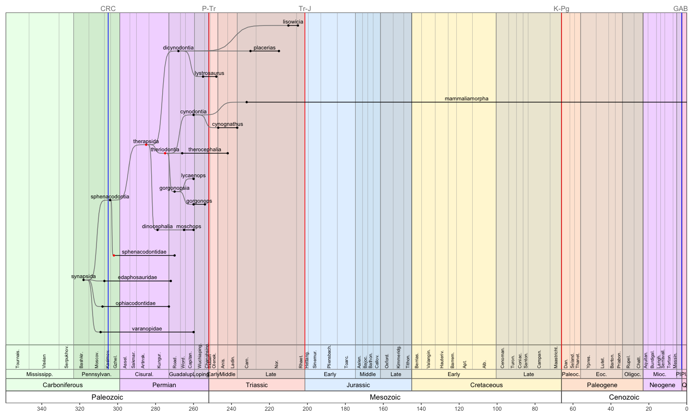
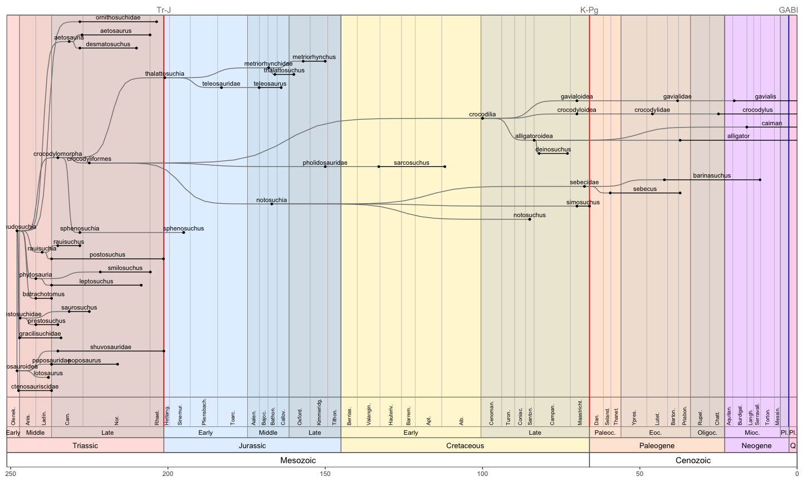

<!-- README.md is generated from README.Rmd. Please edit that file -->

# arboretum

<!-- badges: start -->
<!-- badges: end -->

Plot customised phylogentic trees.

## installation

You can install the development version of arboretum from
[GitHub](https://github.com/) with:

``` r
# install.packages("devtools")
devtools::install_github("dkidney/arboretum", ref='main') # or ref='develop'
```

## main functions

There are two main functions in this package:

- `tree()` - plot static trees using the `ggplot2` library as a backend

- `tree_app()` - an experimental Shiny app for dynamic exploration of
  tree structure

## examples

Load the package (and check the version)

``` r
library(arboretum)
packageVersion("arboretum")
#> [1] '0.2.0'
```

Plot the default tree. By default, any branch node ending in ‘-ae’,
‘-morpha’ or ‘-formes’ will be collapsed.

``` r
tree()
```


Use the `taxon` argument to create a tree for a specific taxon, using
the default rule for collapsing branches.

``` r
 tree(taxon = 'dinosauria')
```


Use the `collapse` argument to choose which branches in the tree are
collapsed.

``` r
tree(taxon = 'dinosauria',
     collapse = c('sauropodomorpha',
                 'ornithopoda',
                 'theropoda',
                 'ankylosauria',
                 'stegosauria',
                 'pachycephalosauria',
                 'ceratopsia'))
```


Use `collapse='none'` to see all available branches.

``` r
tree(taxon='sauropoda', collapse='none')
```


Other example trees:

``` r
tree('tetanurae', collapse='avialae')
```


``` r
tree('sauropterygia', collapse='none')
```


``` r
tree('synapsida')
```



``` r
tree('pseudosuchia', collapse='none')
```


