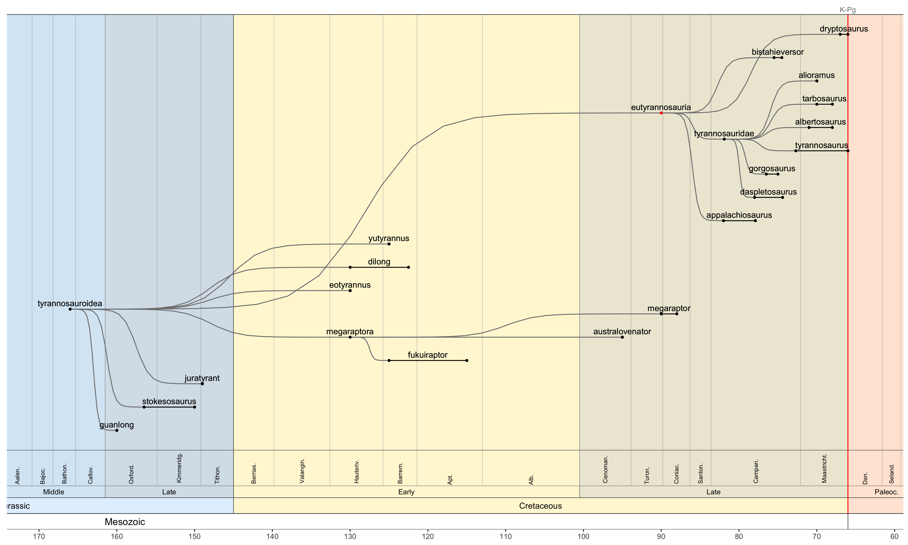

<!-- README.md is generated from README.Rmd. Please edit that file -->

# arboretum

<!-- badges: start -->
<!-- badges: end -->

Plot customised phylogentic trees.

## Installation

You can install the latest version from [GitHub](https://github.com/)
with:

``` r
if (!requireNamespace("devtools")) install.packages('devtools')
devtools::install_github("dkidney/arboretum", ref="main")
```

## Examples

Load the package (and check the version)

``` r
library(arboretum)
packageVersion("arboretum")
#> [1] '0.2.0'
```

There are two main functions in this package:

- `tree()` - plot static trees using the `ggplot2` library as a backend

- `tree_app()` - an experimental Shiny app for dynamic exploration of
  tree structure

## `tree()`

Plot a tree for a specific using the `taxon` argument.

By default, any branch node ending in ‘-morpha’, ‘-formes’, ‘-oidea’,
‘-idae’, ‘-inae’, ‘-ini’ or ‘-ina’ will be collapsed, unless you use the
`collapse` argument to specify which taxa you wish to collapse.

Here are some examples.

``` r
tree('tetrapodomorpha')
```


------------------------------------------------------------------------

``` r
tree('reptiliomorpha', collapse=c('diapsida', 'therapsida'), xmin=-345, xmax=-252)
```


------------------------------------------------------------------------

``` r
tree('therapsida', xmax=-200)
```


------------------------------------------------------------------------

``` r
tree('ornithischia', collapse='none')
```


------------------------------------------------------------------------

``` r
tree('sauropoda', collapse='none')
```


------------------------------------------------------------------------

``` r
tree('tyrannosauroidea', collapse='avialae', xmin=-173)
```


