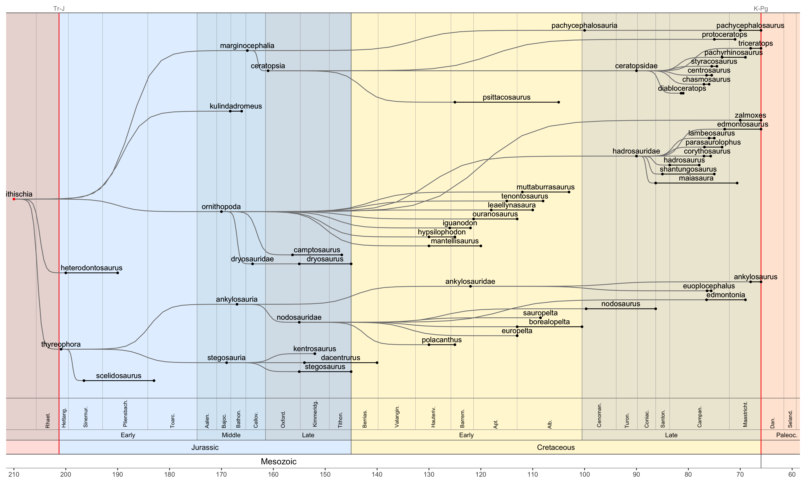

<!-- README.md is generated from README.Rmd. Please edit that file -->

# arboretum

<!-- badges: start -->
<!-- badges: end -->

Plot customised phylogentic trees.

## Installation

You can install the development version of arboretum from
[GitHub](https://github.com/) with:

``` r
# install.packages("devtools")
devtools::install_github("dkidney/arboretum")
```

## Examples

Plot the default tree.

``` r
library(arboretum)
tree() # default settings
```


Create customised trees by selecting a specific taxon and/or collapsing
specific taxa.

``` r
tree(taxon='amniota', 
     collapse=c('archosauromorpha', 'therapsida', 'lepidosauromorpha'))
```


``` r
tree(taxon='archosauromorpha', 
     collapse=c('dinosauria', 'pterosauria', 'pseudosuchia', 'sauropterygia'))
```


``` r
tree('dinosauria', 
     collapse = c('sauropoda', 'ornithopoda', 'theropoda', 'ankylosauria', 'ceratopsia'))
```


``` r
tree(taxon='tetanurae', collapse=c('avialae'))
```


